# Installing Git

## 1. Go to https://git-scm.com/

## 2. Navigate to the Dowloads Section

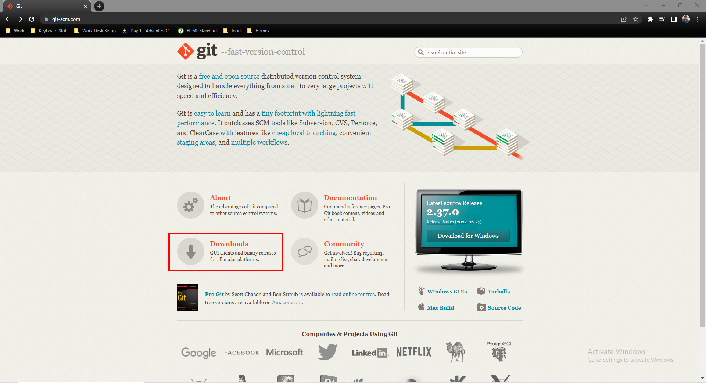

## 3. Choose the version for your system, Windows or MacOS

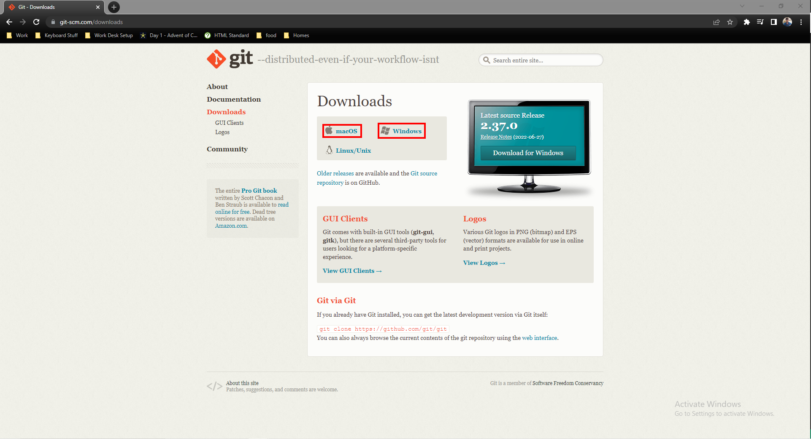

## 4. WINDOWS - Download the Git Installer

## 4a. MAC - Choose the binary installer

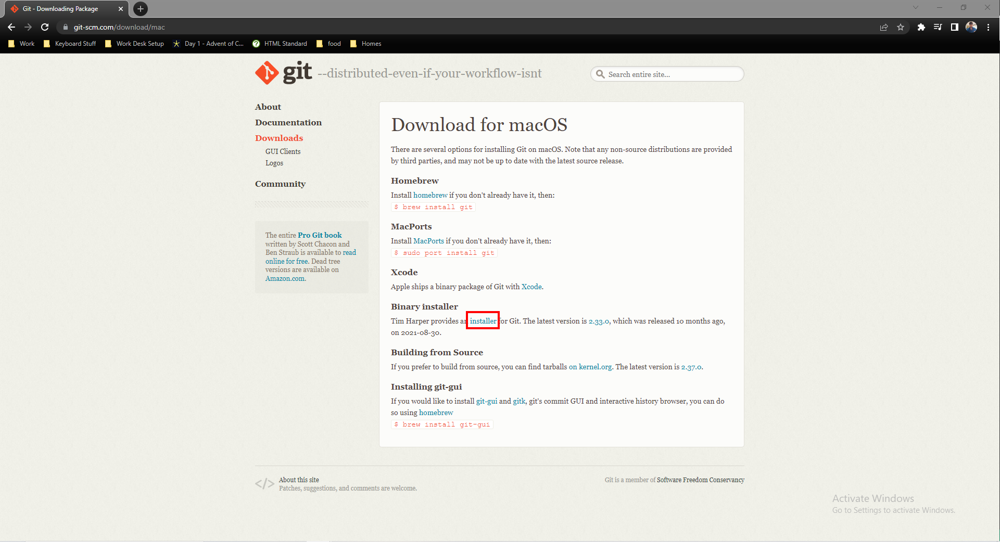

## 4b. MAC - Click the big green `Download` button

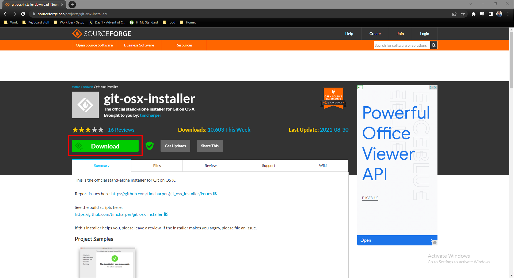

## 4c. MAC - Wait for the download to start, once it has completed you can leave the page

## 5. Run the installer (Some steps may be slightly different on Mac, try to emulate the same setting as close as possible)

## 6. Read the License Information then hit `Next`

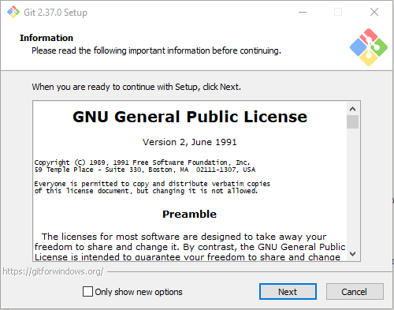

## 7. On the `Select Components` screen leave this default, and then hit `Next`

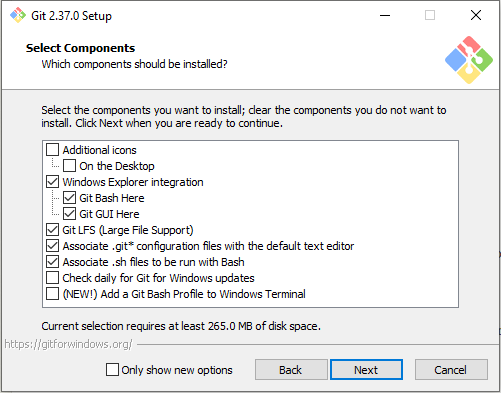

## 8. On the `Choosing the default editor used by Git` screen, choose `Use Visual Studio Code as Git's Default editor` from the dropdown menu, then hit `Next`

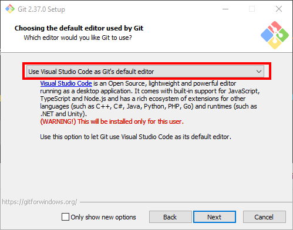

## 9. On the `Adjusting the name of the initial branch in new repositories` screen, choose the `Override the default branch name for new repositories` option, and use the default name of `main`, hit `Next`

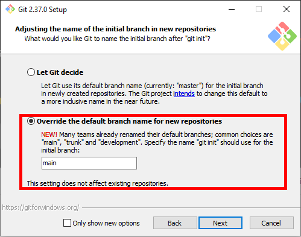

## 10. On the `Adjusting your PATH environment` leave this default and hit `Next`

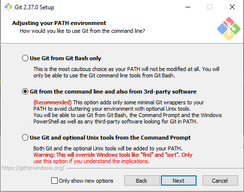

## 11. On the `Choosing the SSH executable` leave this default and hit `Next`

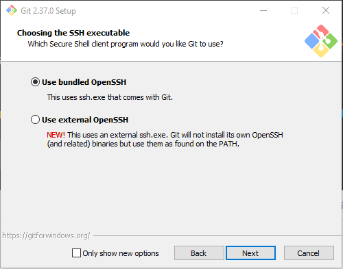

## 12. On the `Choosing HTTPS transport backent` leave this default and hit `Next`

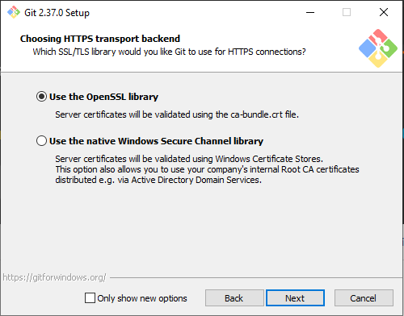

## 13. On the `Configuring the line ending conversions` leave this default and hit `Next`

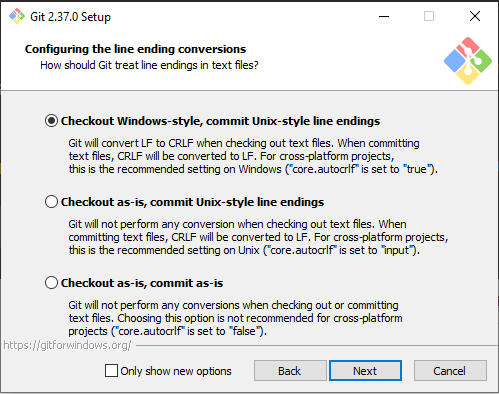

## 14. On the `Configuring the terminal emulator to use with Git Bash` leave this default and hit `Next`

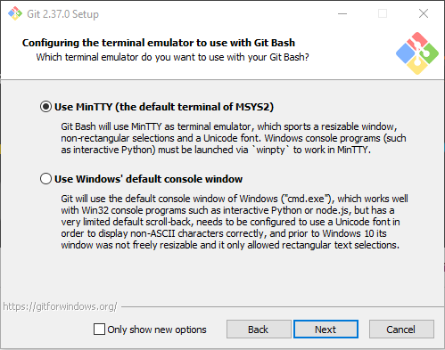

## 15. On the `Choose the default behavior of git pull` leave this default and hit `Next`

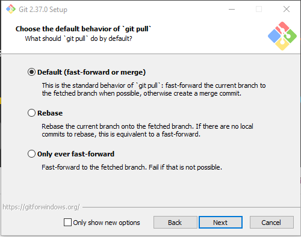

## 16. On the `Choose a credential helper` leave this default and hit `Next`

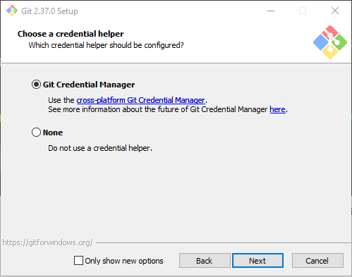

## 17. On the `Configuring extra options` leave this default and hit `Next`

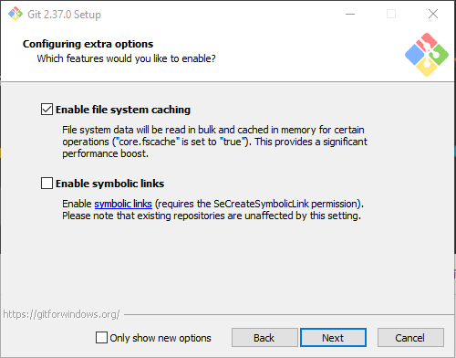

## 18. On the `Configuring experimental options` leave this default and hit `Next`

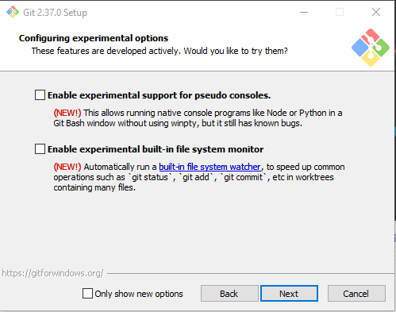

## 19. Hit install

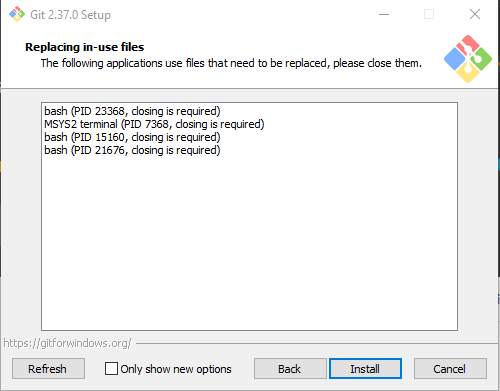

## 20. Hit Finish

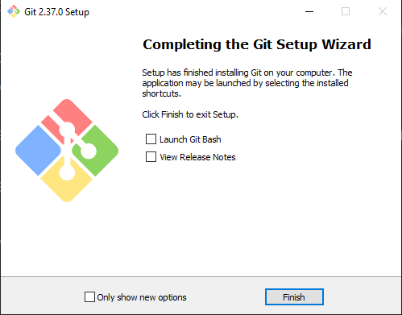

# Installing Java

## 1. Go to the Open JDK website

https://www.openlogic.com/openjdk-downloads?field_java_parent_version_target_id=416&field_operating_system_target_id=All&field_architecture_target_id=391&field_java_package_target_id=396

## 2 MAC. Choose the .pkg download

## 2 WINDOWS. Choose the .msi download

## 3. After downloading, click the installer to start

## 4. On the welcome screen hit `Next`

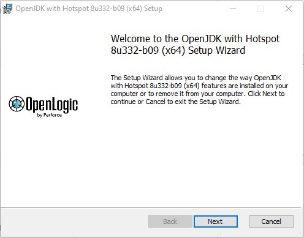

## 5. On the `End-User License Agreement` screen, read the agreement and check the `I accept the terms in the License Agreement` checkbox, then hit `Next`

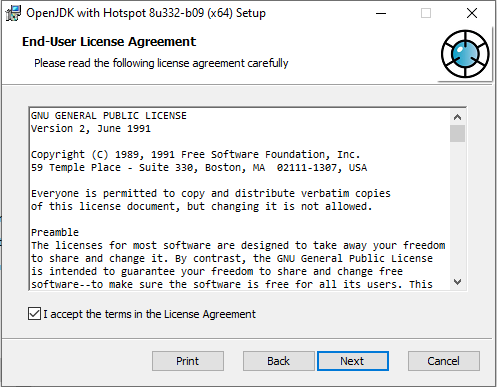

## 6. On the `Custom Setup` screen, click the dropdown next to `Set JAVA_HOME` variable

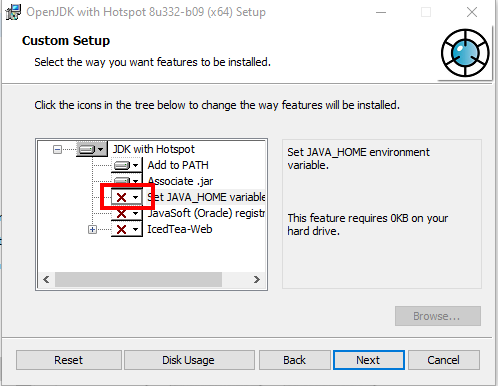

## 7. Choose `Will be installed on local harddrive from the dropdown`, then hit `Next`
The icon should look like the two options above

## 8. Choose `Install`

## 9. Choose `Finish`

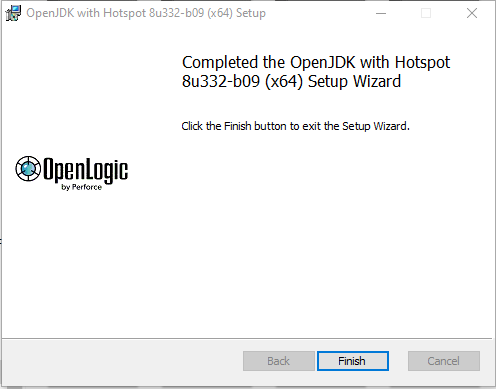