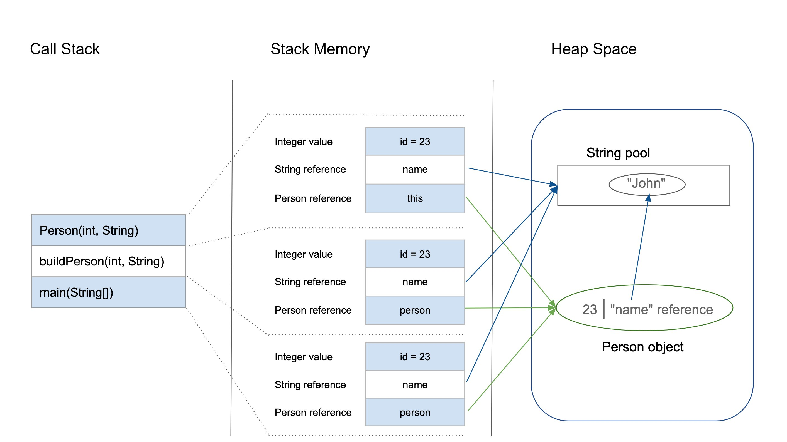

# Java Program Memory

## Heap Memory

Memory for objects in the program

- This stores the reference to objects that we create throughout our program
- When we use the new keyword this will store an object in the heap
- If we run out of heap memory, this causes an OutOfMemoryError

## Stack Memory

Memory that holds method calls, primitive values, and references to objects needed for method calls

- The stack follows First in Last Out
- When a method/constructor is called, its put on the top of the stack
    - Any values or references needed will be found in the heap
    - When the method or constructor is finished, it is popped off the top of the stack, until the program has no method calls left
- If we run out of stack memory, a StackOverflowError occurs



# Garbage Collection

Java automatically removes objects from memory when there is no longer a reference to them

You cannot expliticly call for garbage collection, but you can suggest

- System.gc()
- Runtime.getRuntime().gc()
- System.runFinalize()
    - Finalize is an inherited method from the object class, you can override it to implement logic to run before your object is destroyed

```java
Object o1 = new Object(); //1. a new object is created in memory, and var o1 is referencing it
Object o2 = new Object(); //2. Another new object is created in memory, and var o2 is referencing it
Object o3 = o1; //3. We create a new reference to the first object
o2 = o3; // 4. Now the second variable is pointing at the first object in memory, there are no references to object 2 in memory anymore
//Now at some point, Java will see that the second object has no references, and will eventally remove it
```

# Variable Scopes

In java programming language we have 4 different variable scopes

Each scope defines where the variable is accessible, and how long it is available in the program

Instance Scope, belongs to the object:
- Each individual object instantiated from a class, will have its own value for that specific variable
- While the object exists in memory, the variable exists, because the object is stored in the heap

Static Scope, this sometimes known as class scope, the variable is going to belong to the class itself
- The variable will store the same value across all objects of that class
- If you change the value in one insance, the value will change across all instances of that class
- While this is a special type of variable, it still exists while the object exists in memory, once again because it is stored in the heap


Method Scope, these variables are created inside of a method block
- Once the method is done executing, the variables are no longer availabled
- You cannot access the variable outside of the method block
- Once the method gets popped off the call stack there is no longer any reference to its associated variables in memory

Block Scope, these variables are created inside more specific code blocks
- Typically loops or if statements
- Once again, after the loop, or other block of code is finished running, the variable no longer exists
- You can't access the variable outside of that block

# String API

In Java Strings are an object derived from the String class

Strings store a sequence of characters as their state

- You cannot change/modify the content of a string after it is set, this means that is is immutable
- If you want to change the value of a String, you must completely override the current value stored

Like many other java classes, the String class has several useful methods attached to it:
- charAt(int index)
- concat(String str)
- indexOf(char ch)
- length()
- subString(int start, int end)
- and more

Something to keep in mind with the String methods, is that since Strings are immutable, all of the string methods return a new string
- They will NOT modify the string you call the method on
- `someString = "hello"`
- `someString = someString.concat("Some more string")`
- `someString = someString + "Some more String"`

Strings are objects, so they get stored in memory like reference objects, however String are special

Since we use Strings so often, they get their own special place in memory called the String Pool

- String pool is going to be in the Heap

There are no duplicates allowed in the String pool
- This save on memory

Any duplication String, will point to the same reference in the String pool

If for some reason you want two Strings to store the same sequence but be different objects, you can use the String constructor instead of String literals

String literal is where you use the quotation marks
- Anystring created by a string literal will be stored in the string if not already created
- Anything String created by the constructor not in the String pool will also be added

## StringBuilder and StringBuffer

StringBuilder is a class which allows us to create mutable strings

- Store a sequence of characters just like Strings
- But allows us to manipulate the sequence of characters directly
    - append()
    - insert()
    - delete()
    - and more

Be careful about StringBuilder when threads are involved because StringBuilder is not thread safe

StringBuffer is essentially the same thing as StringBuilder, except you can use it with threads because it is thread safe

# Scanner Class

So far we have manually input all data for our applicatio

In Java we have the scanner class in java.utils, which can read user input from the console/terminal

Most typically the scanner will be used with System.in as its source, this is explicitly how we user input

The Scanner class has methods to get entire lines of text, numbers, letters, and more from the console