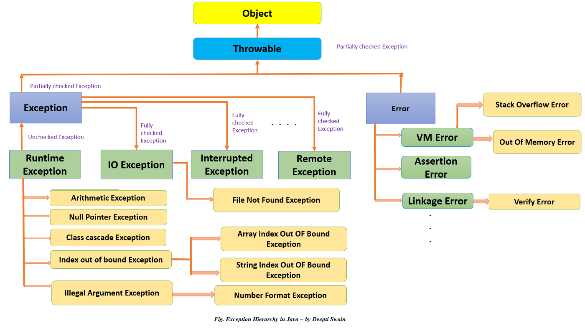

# Exceptions

Exceptions are events that occur during the execution of our program that disrupt the normal flow

When an Exception occurs, Java creates an Exception object and it gets `thrown`

Exceptions a way for Java, or other developers to tell us when something has gone wrong, but we are able to recover from that problem if handled correctly

## Exceptions Class Hierarchy

Exceptions in Java follow a hierarchys starting with a class called `Throwable`
- Any class that extends the Throwable class can be thrown using the `throw` keyword

The two main classes which extend `Throwable` are `Exception` and `Error`

Errors are similar to exceptions, except they typicaly signify a worse problem, and typically cannot be recovered from

`Exception` is the parent of all exceptions in Java

`RuntimeException` extends `Exception`



## Checked vs Unchecked Exception

The type of the Exception being thrown will determine which of the Two Exception classes is the parent of that Exception Object

## Checked Exceoptions

Will extend Exception

Caught at compile time
- MUST be handled by the programmer
- Child of the Exception class

Examples:
- FileNotFoundException
- ClassNotFoundException
- CloneNotSupportedException

## Unchecked Exceptions

Caught during the runtime of our application
- Not required to be handled by the programmer, typically going to be thrown by a bug
- Child of the RuntimeExeption class

Examples:
- ArithmeticException
- IndexOutOfBoundsException
- NullPointerException

## Handling or Declaring Exceptions

As mentioned above, all checked excpetions must be handled by the programmer

There are two ways to handle these exceptions
- try/catch block
- ducking with the `throws` keyword

The try/catch/finally block allows you to enclose risky code that may throw an exception inside of the try block

The catch block takes in the specific exception you are expecting, with any logic to handle the exception inside of the block

The finally block is optional, it will run some logic regaurdless of the outcome of the try or catch block


```java
try{
    risky code
} catch (Exception e){
    logic
} finally {
    logic
}
```

Some rules for try/catch/finally
- Multiple catches are allowed, but they must go from specific to least specific (children of Exception/RuntimeException first then Exception)
- You can catch more than one exception in a single catch block using the pipe symbols ||
- Finally is completely optional
- try/finally are legal, but a try block by itself is not

## Try with Resources

Java 7 implemented a new use for the try catch block, try with resources allows you to add a resource in the try block, and Java will automatically close the resource for you when you are finished using it

The only catch is that the object in the try parenthesis must implement the AutoCloseable interface


The second way of handling exceptions is called ducking

This is done by declaring that a method could throw an exception
- Use the `throws` keyword in the method declaration

This tells Java that is is whatever entity that calls the methods responisibility to handle the exception

## How to manually throw an exception

Inside of our program there may be a time where we want to manually throw an exception

To do so we use the `throw` keyword along with creating a new Exception object

`throw new Exception()`

## Custom Exceptions

Programmers are able to create our custom exceptions to be thrown when something specific to our program occurs

This help other developers using the program/library you created know what they did wrong

Or you could use these to log things going wrong inside of your application

To create a custom exception you can do one of two things:

- Extend the Exception class to create a checked exception
- Extend the RuntimeException class to create an unchecked exception