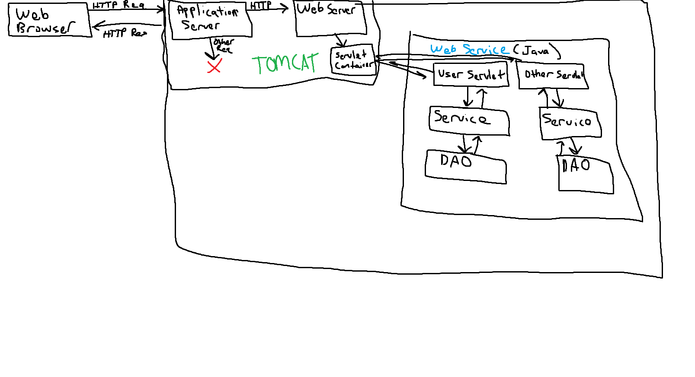
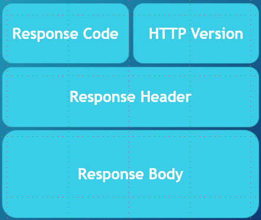

# Client Server Architecture

A client-server arch is a networking model in which the server provides services to clients to perform user based tasks

Server: is a server software designed to process request and deliver responses to another computer over the internet

Client: is a program that runs locally, and makes requests to a server

A client and server established a connection over the internet using a set rules called protocols

There are different protocols for different purposes, we will be using HTTP

-   Clients send HTTP requests to the server, in the form of XML or JSON
-   Server sends HTTP responses to the client

Types of Client-Server Arch

-   2-tier: Simple client to server interface
-   3-tier: Client establishes a connection to a middleware, then the middleware connects to the server
-   n-tier: multiple layers between the client and server

# What is a Servlet

A servlet is a Java class that takes incoming requests, processes them, and generates a response to send back to the user

# Web/Application Server and the Servlet Container

A webserver is used to handle HTTP requests, where as an Application server is used to handle any type of requests

Application servers pass incoming requests to the application running it, most application servers double as webservers

We will be using Tomcat as our application server

The servlet container is component of some application servers that interacts with the Java servlets

-   They are responsibly for managing the life cycle of servlets
-   Mapping a URL to a specific servlet
-   Ensuring the URL requester has the correct access

The built in servlet container in Tomcat is called Catalina

How servlets work:

# What are Web services

A webservice is a software that allows machines to exchange and make use of information over a network
- We will enable this with the use of Servlets

These services must comply to a set of standards, and be exposed via a consumable API

Two types of webservices:

- REST
- SOAP

## Advantages of Web Services:

We can use the web as a transactional tool, rather than to simply display data

Expose functionality of a business service both within and outside of your application, making you functionality reusable by others

Capitalize on existing standards, creating standardization

Hardware and OS independent

Loose coupling of programs

# Introduction to Rest

Representation State Transfer

-   Architectural style that outlines communication between a client and a server

The outline is a set of guides/constraints for developing a webservice

## Rest Constraints

To be considered RESTful the webserice must follow these guidlines

-   Uniform interface: the service must adhere to a commonly decided API standard
    -   Identification of Resources: the URL
    -   Manipulation of resources through representations: a request yields a state of a resource
    -   Self-descriptive message
    -   Hypermedia as the engine of application state
-   Client-Server: separation of concerns
-   Stateless: the server should not retain any information about the client
-   Cacheable: Responses shopuld be explicitly labeled as cacheable or not
-   Layered System: The system should be organized by layers sucht hat components only communicate with components that are part of their layer
-   Code on demand: an optional constraint which allows executable code or scripts to be sent with requests

## Resources in Rest

Resources are anything or any information that can be named

We typically represent these resources with some standard such as JSON or XML

To identify a resource with a RESTful service we use URL's (Unified Rescource Locator), this is called the resource identifier

RESTful services should have uniform resource identifiers, so here are some rules you can follow
- use nouns to name resources
- begin you uri with the plural collection of a particual resource
- use path parameters it identify a single resource in specific document/record
- capitalize on path structure to represent hiearchy
- identify store of resources that managed by the client (sub-collections)
- use query paremeters to filter resources of particular type
- be consistant across the board

The biggest thing with REST is to be consumer first

## Rest Content Negotiation

Content Negotiation is the process of selecting the best reprensentation for a given response when there are multiple representations available

This is done on the server side based on the media type in the request header

You can do this by either setting the Conten-Type of the request header to a specified type, the server can also read the ACCEPT attribute of the header to read what kind of data the client wants

You can also do with with URL patterns, include the specific content type extension

-   http://someserver/person.html
-   http://someserver/person.json

## Richardson Maturity Model

This is a model that breaks down the principle elements of the REST approach into three steps

0. Start with HTTP
    - Interactions for your application are built on HTTP, with some type of payload
1. Introduce Resources
    - API endpoints that will be directed at particular resources
2. Verbs of HTTP
    - Tie the actions take as closely as possible with the verbs of HTTP
3. HyperMedia Controls
    - The point of hypermedia controls is that they tell us what we can do next, and a way of receiving the information back from the service

As mentioned above, we will be using the HTTP protocol to connect/send messages to and from the REST webservice

# Introduction to HTTP

Hypertext Transfer Protocol, it is a client server protocol

It allows us to send information between clients (websites) and servers (your java) via HTTP messages using the TCP

# HTTP Request and Response Contents

HTTP Requests are the messages sent from the client to the server

They are composed of:

-   Verb: the HTTP method being executed
-   URI: the endpoint of the resource
-   HTTP Version
-   Request Header: contains metadata about the request
-   Request Body: contain any data we are sending to the server in the request

HTTP Response are the message sent from the server to the client

They are composed of:

-   Response/Status code: information about the success of failure of the request
-   HTTP Version
-   Response Headers: contains metadata
-   Reponse Body: any data being sent back to the client from the server (the resource we were requesting)

# HTTP Verbs

Two important characteristics of these HTTP methods

## Idempotent

identical requests can be made once or several times in a row and return the same exact response

## Safe

the request does not alter the state of the server/database

## GET

-   Used to retrieve data
-   No request body
-   idemptotent
-   safe
-   cacheable
-   allowed in html forms

## HEAD

-   This is almost the same as GET, but the servers response CANNOT include a body
-   Used to retrieve
-   No request body
-   safe
-   idempotent
-   cacheable
-   not allowed in html forms

## POST

-   Used to send data to the server
-   will often be used to create or update data
-   not idempotent
-   not safe
-   not really cacheable
-   allowed in html forms
-   request and response bodys

## PUT

-   typically used to update a target resource such that it replaces the current representation with the one included in the PUT
-   is idempotent
-   not safe
-   not cachable
-   not allowed in html forms
-   response does not have a body
-   request does have a body

## DELETE

-   used to delete a resource
-   might have a request or response body
-   not safe
-   not cacheable
-   not allowed in html forms
-   idempotent

## CONNECT

-   starts a "tunnel" two way communication with a resource
-   No request body
-   Receives a response body
-   Not safe
-   Not idepotent
-   Not cacheable
-   Not supported in html forms

## OPTIONS

-   get the options for communication a particular resource
-   safe
-   indempotent
-   request has no body
-   reponse has a body
-   not cacheable
-   not allowed in html forms

## TRACE

-   message loop-back test between client and resource
-   useful for debugging
-   no request or response body
-   not safe
-   not cacheable
-   not allowed in html forms
-   idempotent

## PATCH

-   similar to update
-   change a particular aspect of a resource
-   request and response have a body
-   not safe
-   not idempotent
-   not allowed in HTML forms
-   not cacheable

# HTTP Status Codes

Status codes give us information about our request

Informational Codes: 100-199

Successful Responses: 200-299

-   200 OK
-   201 CREATED
-   202 ACCEPTED

Redirect: 300-399

-   300 Multiple Choices
-   301 Moved Permanently
-   302 Found

Client Errors: 400-499

-   401 Unauthorized
-   403 Forbidden
-   404 Not Found

Server Errors: 500-519

- 500 Internal Server Error
- 503 Service Unavailable

